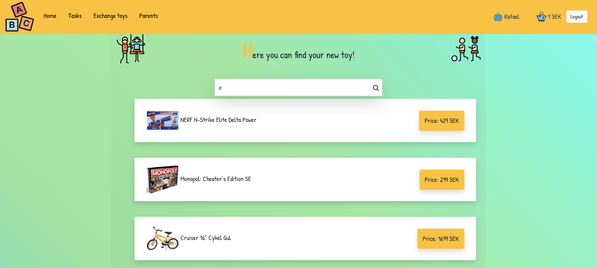
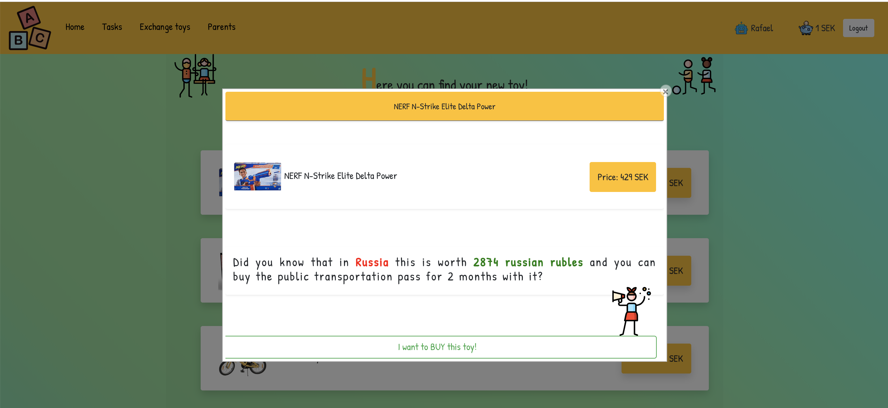
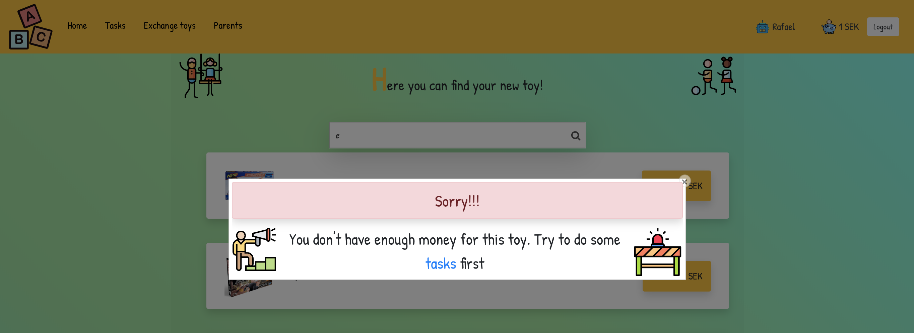
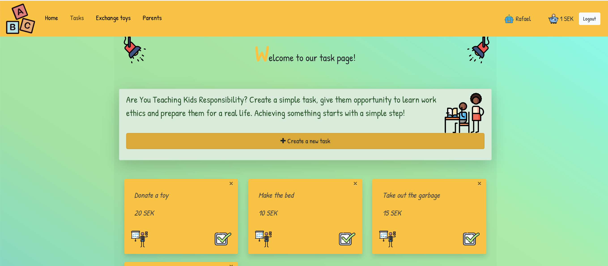
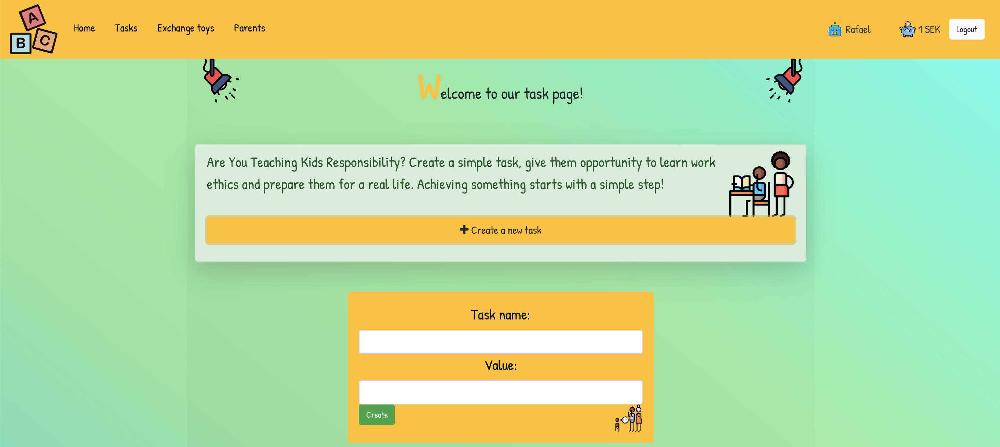
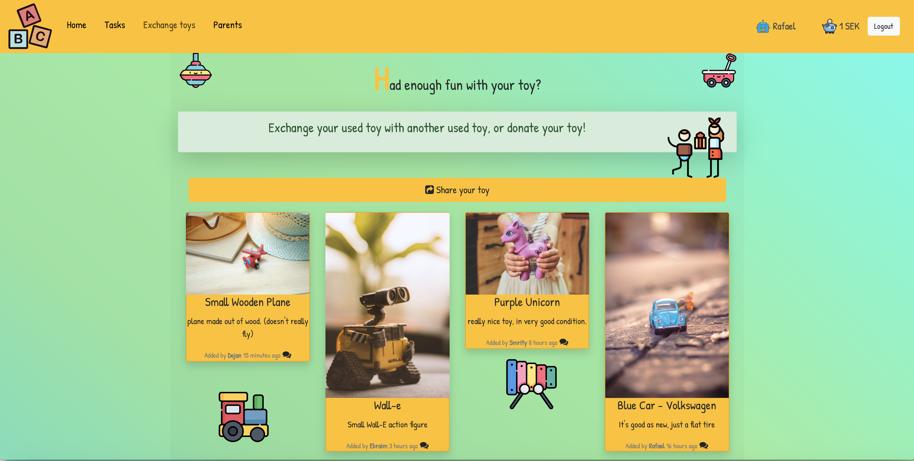
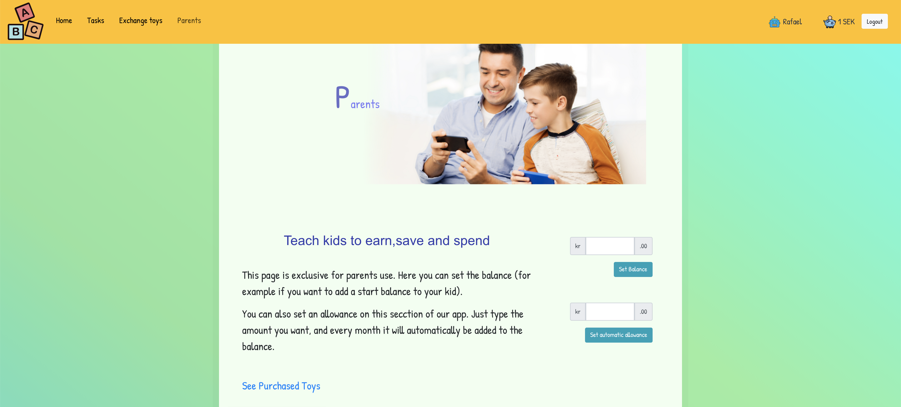

# ToyFy - WebApp For Kids

## Project Overview:

ToyFy web-application’s aim is to educate the children about the value of money and currency by comparing the value of their favorite toy in different countries in the world.
 This WebApp is specially designed for children of age group 5 - 13 years. The point is not to prevent the kid from getting the wanted toy, but to give them some understanding of money value and to prepare them for their future. This application enables parents to create their own profile and children can also use the same.

## Project design and framework:

* Gradle: This is a Gradle based project.
* Spring(Backend server): A Java based  framework with MVC and Hibernate 
dependencies is used.
* React(Frontend development server): A framework to develop the frontend part of the project.
* Database (Postgres).

## Pre-requisites:
* Install `docker` and `docker-compose`.
* Install `Nodejs`.
* Install a proper IDE/Text editor forJava and Javascript. IntelliJ community edition is recommended for Java development but doesn't work very well with JavaScript. It's therefore recommended to use VS Code or any other JavaScript-friendly IDE when working with frontend code.

## Starting the database:
 
To start the database open the terminal and ` cd ` your way in to the project root folder. You can just simply run
`docker-compose up` to start the database. Closing the terminal will kill the database. So you need to restart the database every time you need to use it.

## Starting the backend server:
Open the root folder in IntelliJ and import all the gradle dependencies (this has to be done only once).
Make sure that the database is running (see steps above) otherwise the backend won't have access to it. Then run the main class at
> src/main/java/se/kth/sda6/skeleton/SkeletonApplication.java to start the web server.

## Starting the frontend development server:

To install the project dependencies for the frontend, open the terminal and make sure that the current directory is `frontend`. You can then run `npm install` to install all the dependencies needed for the project (This has to be done only once).
 
To start the frontend server run `npm start` from the `frontend` directory. Make sure that database and backend server are also running so that the frontend can interact with the backend.

------------------------------------------------------------------------
------------------------------------------------------------------------

# Let’s start using ToyFy web application.

## Welcome to the world of toys!

#### The application allows a user to:
 * search and choose toy,
 * change currency,
 * create a task,
 * set balance (page available only for parents),
 * add not used toy and exchange toy with others.
#### The user is be able to:
 + search toy
 + buy toy
 + add tasks
 + mark task as done tasks
 + add own toy
 + choose other old toy from list
 + set balance - available only for parents
The user can logout from the application whenever he/she wants.

> User can see the short description about app on left side of Main page and Login with Sign up blocks on right side!

#### To start using app:
New user needs to Sign up block and add:
* Name,
* Email,
* Password
#### Already registered user needs to go to Login block and add:
* Email,
* Password

------------------------------------------------------------------------
#### 1. Home Page
> Here you can find your new toy!
> In search block:

 

> Enter the toy which you want
Click on your favourite toy
Popup will show you :
* Picture
* Description
* Price
* Currency
* Message about what you can buy for that money in other country
* Buy button in the right side

> After Clicking on the buy button - You will see a popup message:
Price from toy is going automatically to the balance 

> If you do not have enough money you will not be able to buy any toy and has to perform some tasks to earn money
------------------------------------------------------------------------
 #### 2. Task

 Welcome to our task page!!
* Click plus to create a task
Popup will show you task which you can create
 Page is showing list of tasks. 
Each task has Done button which suppose to be pressed after finishing.

> Congratulations now you have enough money to go back to Home page and buy toys.
------------------------------------------------------------------------
#### 3. Exchange toys 

* Exchange your used toy with another used toy!
 
* See available toys
 
* Will show toys which other kids already added and want to exchange
 
* Add a picture of your toy
 
* Click plus and add picture of toy which you want to exchange

 

----------------------------------------------------------------------
#### 4. Parents 

Teach kids to earn, save and spend
Parents can:
 
* Set Balance
* Set Allowances
* See Purchased Toys

